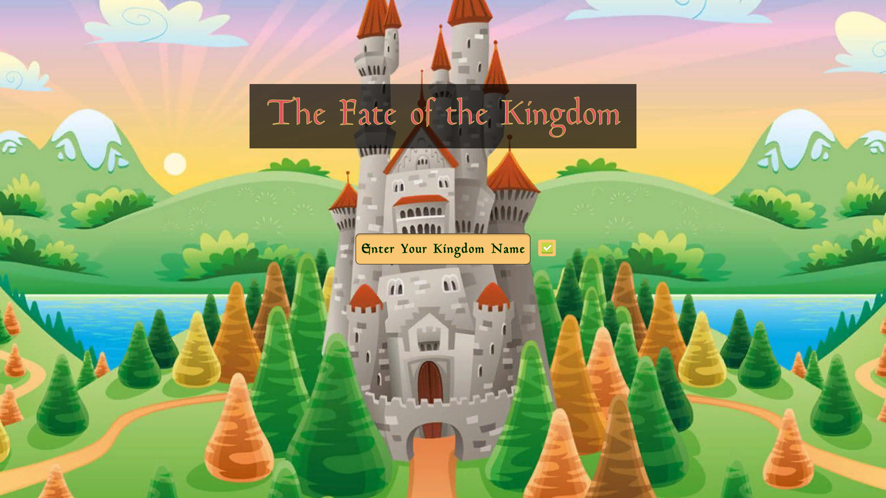
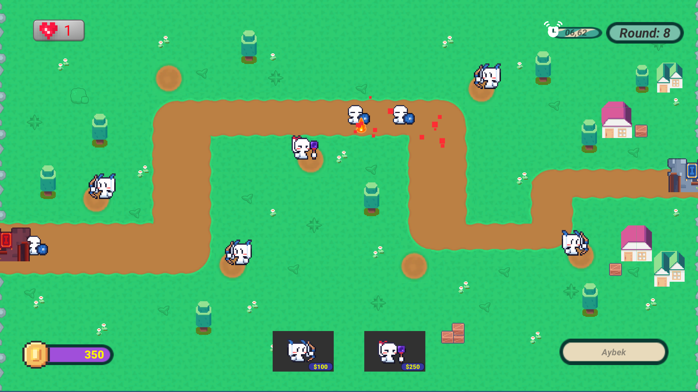
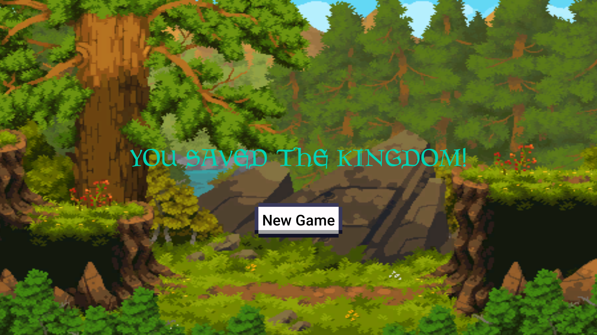
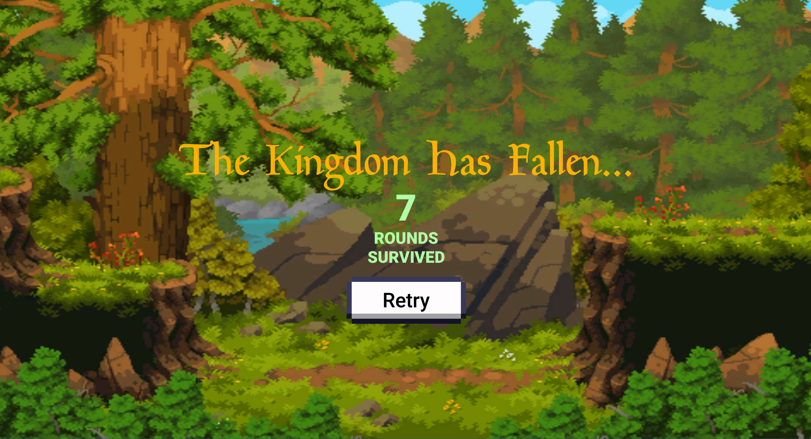

<h3 style="color:green">My first Tower Defense game I made with Unity.</h3> 

<h4 style="color:red">DOWNLOAD</h4>
<h5>After downloading the <mark><i>TowerDefense_PC</mark></i> file, you can play the game by clicking <mark><i>The Fate of the Kingdom.exe .</mark></i></h5>

<h4 style="color:red">Main Menu Screen:</h4>

<h4 style="color:red">Game Scene:</h4>

<h4 style="color:red">Win Screen:</h4>

<h4 style="color:red">Game-Over Screen:</h4>

